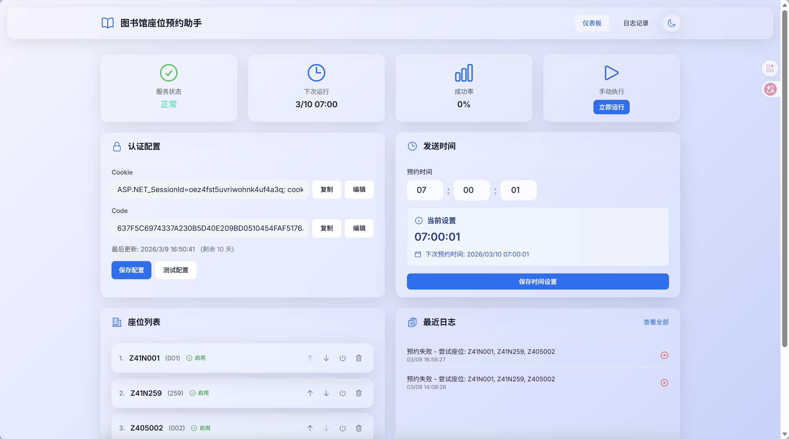
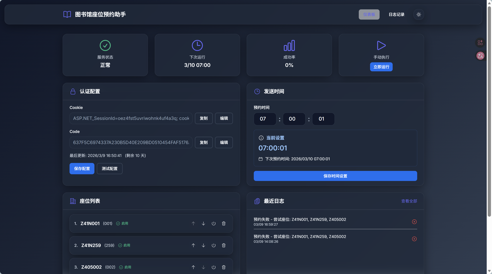
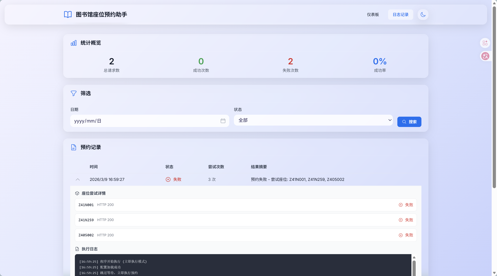

# 📚 图书馆座位预约助手

[](https://www.python.org/downloads/)
[](https://fastapi.tiangolo.com/)
[](https://vuejs.org/)
[](LICENSE)

> 湖南师范大学图书馆座位自动预约系统，支持 Web 界面配置和手动执行

## ✨ 功能特性

- 🎯 **自动预约** - 定时自动执行座位预约，无需人工干预
- 🌐 **Web 管理界面** - 现代化的 Vue 3 前端，支持可视化配置
- 📊 **日志记录** - 完整的执行日志和统计数据
- 🎨 **深色模式** - 护眼的深色主题，一键切换
- ⚡ **手动执行** - 支持在 Web 界面立即运行预约任务
- 🔄 **多座位重试** - 支持配置多个备选座位，提高成功率
- 📱 **响应式设计** - 完美适配桌面和移动设备

## 🛠️ 技术栈

### 后端
- **Python 3.8+** - 核心运行环境
- **FastAPI** - 现代高性能 Web 框架
- **PyYAML** - 配置文件管理
- **Requests** - HTTP 请求库

### 前端
- **Vue 3** - 渐进式 JavaScript 框架
- **TypeScript** - 类型安全
- **Vite** - 下一代前端构建工具
- **Tailwind CSS** - 实用优先的 CSS 框架
- **Pinia** - Vue 状态管理
- **Heroicons** - 精美的 SVG 图标库

## 📁 项目结构

```
library-reserve-script/
├── backend/                 # 后端代码
│   ├── app/
│   │   ├── main.py         # FastAPI 应用入口
│   │   ├── routers/        # API 路由
│   │   ├── services/       # 业务逻辑
│   │   └── models/         # 数据模型
│   └── requirements.txt    # Python 依赖
├── frontend/               # 前端代码
│   ├── src/
│   │   ├── views/          # 页面组件
│   │   ├── components/     # UI 组件
│   │   ├── api/            # API 接口
│   │   ├── stores/         # 状态管理
│   │   └── types/          # TypeScript 类型
│   └── package.json        # Node.js 依赖
├── logs/                   # 日志目录
├── reserve_seat.py         # 预约脚本主程序
├── config.yaml             # 配置文件（需自行创建）
└── README.md               # 项目文档
```

## 🚀 快速开始

### 环境要求

- Python 3.8+
- Node.js 16+
- npm 或 yarn

### 安装步骤

#### 1. 克隆项目

```bash
git clone https://github.com/yourusername/library-reserve-script.git
cd library-reserve-script
```

#### 2. 后端配置

```bash
# 创建虚拟环境
python -m venv venv

# 激活虚拟环境
# Windows:
venv\Scripts\activate
# Linux/macOS:
source venv/bin/activate

# 安装依赖
cd backend
pip install -r requirements.txt
```

#### 3. 前端配置

```bash
cd frontend
npm install
```

#### 4. 创建配置文件

在项目根目录创建 `config.yaml` 文件：

```yaml
auth:
  cookie: "你的 Cookie"
  code: "你的预约验证码"
  last_update: "2024-01-01T00:00:00"
  expires_days: 10

reserve:
  send_time: "07:00:02"  # 预约执行时间
  seats:
    - id: "Z41N001"      # 座位编号
      name: "001"
      enabled: true
    - id: "Z41N259"
      name: "259"
      enabled: true
  retry:
    max_attempts: 3      # 最大重试次数
    delay_seconds: 1     # 重试间隔（秒）

request:
  url: "https://libwx.hunnu.edu.cn/apim/seat/SeatDateHandler.ashx"
  data_template:
    data_type: "seatDate"
    seatdate: "today"
    datetime: "660,1350"  # 预约时间段

metadata:
  version: "1.0.0"
  created_at: "2024-01-01T00:00:00"
  updated_at: "2024-01-01T00:00:00"
```

### 运行项目

#### 方式一：使用批处理文件（Windows）

```bash
# 启动后端（在 backend 目录）
run.bat

# 启动前端（在 frontend 目录）
run.bat
```

#### 方式二：手动启动

```bash
# 终端 1 - 启动后端
cd backend
python -m uvicorn app.main:app --reload --host 0.0.0.0 --port 8000

# 终端 2 - 启动前端
cd frontend
npm run dev
```

#### 访问应用

- **前端界面**: http://localhost:5174
- **API 文档**: http://localhost:8000/docs
- **健康检查**: http://localhost:8000/api/status/health

## 📖 使用说明

### 1. 获取 Cookie 和 Code

1. 使用微信访问湖南师范大学图书馆预约页面
2. 使用浏览器开发者工具抓取请求
3. 从请求头中提取 `Cookie` 值
4. 从请求体中提取 `code` 参数

### 2. 配置预约

1. 访问 Web 管理界面 (http://localhost:5174)
2. 在「认证配置」卡片中填入 Cookie 和 Code
3. 在「预约时间」卡片设置执行时间
4. 在「座位管理」卡片添加/启用/禁用座位

### 3. 测试执行

- 点击「立即运行」按钮测试预约功能
- 在「最近日志」卡片查看执行结果
- 访问「日志记录」页面查看详细历史

### 4. 定时任务

使用系统定时任务（如 Windows 任务计划程序或 Linux cron）定时运行：

```bash
python reserve_seat.py
```

## 🎨 功能截图

### 仪表板 - 亮色模式


### 仪表板 - 深色模式


### 日志记录


## ⚙️ 配置说明

### auth 配置

| 字段 | 说明 | 示例 |
|------|------|------|
| cookie | 用户认证 Cookie | `ASP.NET_SessionId=xxx;` |
| code | 预约验证码 | `637F5C69...` |
| last_update | 最后更新时间 | `2024-01-01T00:00:00` |
| expires_days | Cookie 过期天数 | `10` |

### reserve 配置

| 字段 | 说明 | 默认值 |
|------|------|--------|
| send_time | 预约执行时间 | `07:00:02` |
| seats | 座位列表 | - |
| retry.max_attempts | 最大重试次数 | `3` |
| retry.delay_seconds | 重试间隔（秒） | `1` |

### request 配置

| 字段 | 说明 | 示例 |
|------|------|------|
| url | 预约接口地址 | `https://libwx.hunnu.edu.cn/...` |
| data_template.data_type | 数据类型 | `seatDate` |
| data_template.seatdate | 预约日期 | `today` |
| data_template.datetime | 时间段 | `660,1350` (11:00-22:30) |

## 🔧 开发指南

### 后端开发

```bash
cd backend

# 运行开发服务器
python -m uvicorn app.main:app --reload

# 访问 API 文档
# http://localhost:8000/docs
```

### 前端开发

```bash
cd frontend

# 运行开发服务器
npm run dev

# 构建生产版本
npm run build

# 类型检查
npm run type-check

# 格式化代码
npm run format
```

### API 端点

| 方法 | 路径 | 说明 |
|------|------|------|
| GET | `/api/config` | 获取完整配置 |
| PUT | `/api/config/auth` | 更新认证配置 |
| PUT | `/api/config/reserve` | 更新预约配置 |
| GET | `/api/status` | 获取系统状态 |
| POST | `/api/reserve/run` | 手动执行预约 |
| GET | `/api/logs` | 获取日志列表 |
| GET | `/api/logs/stats` | 获取统计数据 |

## ⚠️ 注意事项

1. **Cookie 有效期** - Cookie 和 Code 有效期约为 10 天，需要定期更新
2. **配置文件安全** - `config.yaml` 包含敏感信息，已添加到 `.gitignore`，请勿提交到 Git
3. **预约时间** - 建议设置在开馆时间（如 07:00:02）
4. **座位编号** - 座位编号格式为 `Z41N001`，可在图书馆预约页面查看
5. **时间段设置** - `datetime` 参数格式为 `开始分钟,结束分钟`（从 00:00 计算）

## 📝 更新日志

### v1.0.0 (2024-03-09)

- ✨ 初始版本发布
- 🎨 实现深色模式
- ⚡ 添加手动执行功能
- 📊 完善日志记录系统
- 🌐 Web 管理界面

## 🤝 贡献指南

欢迎提交 Issue 和 Pull Request！

1. Fork 本仓库
2. 创建特性分支 (`git checkout -b feature/AmazingFeature`)
3. 提交更改 (`git commit -m 'Add some AmazingFeature'`)
4. 推送到分支 (`git push origin feature/AmazingFeature`)
5. 提交 Pull Request

## 📄 许可证

本项目采用 MIT 许可证 - 详见 [LICENSE](LICENSE) 文件

## 🙏 致谢

- [FastAPI](https://fastapi.tiangolo.com/) - 现代高性能 Web 框架
- [Vue.js](https://vuejs.org/) - 渐进式 JavaScript 框架
- [Tailwind CSS](https://tailwindcss.com/) - 实用优先的 CSS 框架
- [Heroicons](https://heroicons.com/) - 精美的 SVG 图标

## 📮 联系方式

如有问题或建议，请提交 [Issue](https://github.com/yourusername/library-reserve-script/issues)

---

⭐ 如果这个项目对你有帮助，请给一个 Star！
